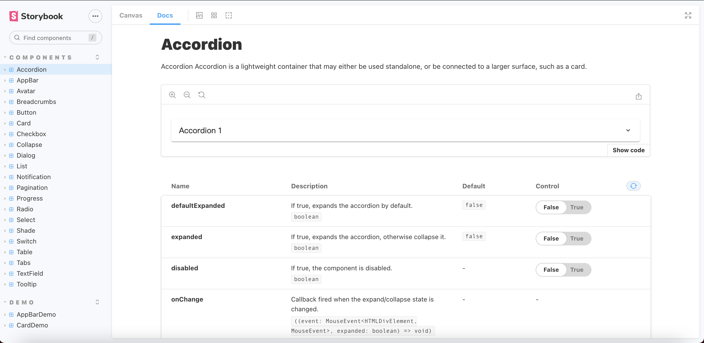
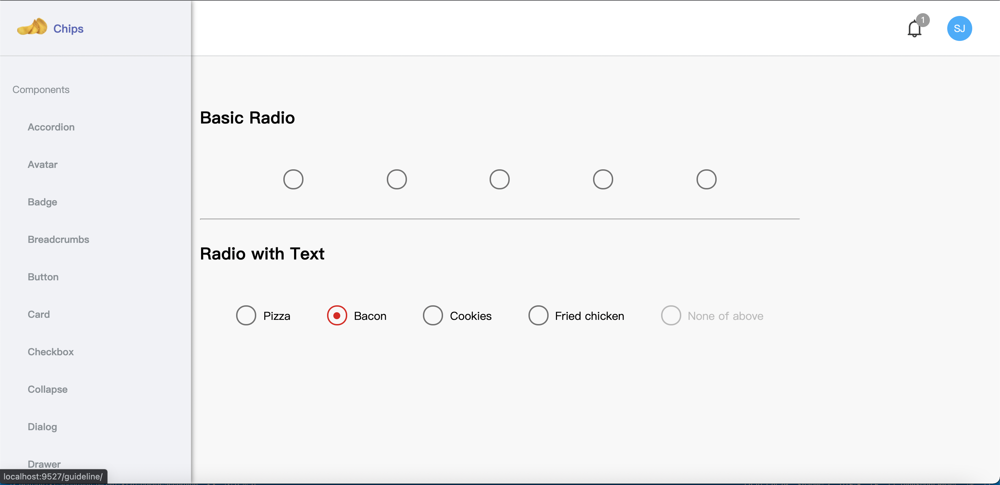

# Material-ui-clone
Build a React UI library clone from material UI 





## Installation
```shell
$ git clone https://github.com/ChaoTzuJung/material_ui_clone.git
$ cd material_ui_clone
$ yarn install && yarn run dev
open web -> http://localhost:9527/
open storybook -> http://localhost:6006/
```

## Todo Roadmap

### Component
  - [ ] Autocomplete
  - [X] Accordion
  - [ ] Alert
  - [X] AppBar
  - [X] Avatar
  - [ ] Backdrop
  - [ ] Bottom Navigation
  - [X] Breadcrumbs
  - [X] Button
  - [ ] Button group
  - [X] Card
  - [X] Checkbox
  - [ ] Chip
  - [X] Collapse
  - [ ] Date Picker
  - [ ] Date Range Picker
  - [ ] Date Time Picker
  - [X] Dialog
  - [ ] Divider
  - [ ] Floating action button
  - [ ] Icons
  - [ ] Image list
  - [X] List
  - [ ] Links
  - [ ] Masonry
  - [ ] Menu
  - [X] Notification
  - [X] Pagination
  - [ ] Paper
  - [X] Progress
  - [X] Radio
  - [ ] Rating
  - [X] Select
  - [ ] Skeleton
  - [ ] Slider
  - [ ] Snackbar
  - [ ] Speed Dial
  - [ ] Stepper
  - [X] Switch
  - [X] Table
  - [X] Tabs
  - [X] TextField
  - [ ] Timeline
  - [ ] Time Picker
  - [ ] Toggle Buttons
  - [X] Tooltip
  - [ ] TTransfer List
  - [ ] Tree View
  - [ ] Typography

### Featrure
  - [ ] Dark Mode
  - [ ] Use styled-components

## File Structure

```
material_ui_clone
├─ packages
│  ├─ core
│  │  ├─ .storybook
│  │  │  ├─ main.js
│  │  │  └─ preview.js
│  │  ├─ CHANGELOG.md
│  │  ├─ README.md
│  │  ├─ babel.config.js
│  │  ├─ package.json
│  │  ├─ rollup.config.js
│  │  ├─ src
│  │  │  ├─ assets
│  │  │  ├─ components
│  │  │  │  ├─ accordion
│  │  │  │  │  ├─ Accordion.tsx
│  │  │  │  │  └─ accordion.scss
│  │  │  │  └─ tooltip
│  │  │  │     ├─ Tooltip.tsx
│  │  │  │     └─ tooltip.scss
│  │  │  ├─ compounds
│  │  │  │  ├─ appBar
│  │  │  │  │  ├─ AppBar.tsx
│  │  │  │  │  └─ appBar.scss
│  │  │  │  └─ index.ts
│  │  │  ├─ costom.d.ts
│  │  │  ├─ customizedHooks
│  │  │  │  ├─ useLoaded.ts
│  │  │  │  └─ useOutsideClicker.ts
│  │  │  ├─ helpers
│  │  │  │  ├─ OutsideClicker.tsx
│  │  │  │  └─ index.ts
│  │  │  ├─ index.ts
│  │  │  ├─ interface
│  │  │  │  ├─ common.ts
│  │  │  │  └─ globalHtml.ts
│  │  │  └─ stories
│  │  │     ├─ assets
│  │  │     ├─ components
│  │  │     │  ├─ Accordion.stories.tsx
│  │  │     │  └─ Tooltip.stories.tsx
│  │  │     └─ demo
│  │  │        ├─ AppBarDemo.stories.tsx
│  │  │        └─ CardDemo.stories.tsx
│  │  └─ tsconfig.json
│  └─ web
│     ├─ CHANGELOG.md
│     ├─ README.md
│     ├─ babel.config.js
│     ├─ environments
│     │  ├─ webpack.base.js
│     │  ├─ webpack.dev.js
│     │  └─ webpack.prod.js
│     ├─ index.html
│     ├─ package.json
│     ├─ src
│     │  ├─ App.tsx
│     │  ├─ api
│     │  │  ├─ index.ts
│     │  │  └─ instance.ts
│     │  ├─ assets
│     │  │  ├─ images
│     │  │  │  ├─ chips_logo.png
│     │  │  │  ├─ giant.jpeg
│     │  │  │  ├─ giant_tooth.jpeg
│     │  │  │  ├─ hange.png
│     │  │  │  ├─ home_chips.png
│     │  │  │  ├─ levi.jpeg
│     │  │  │  └─ new_asus_ico_256x256.png
│     │  │  └─ styles
│     │  │     └─ all.scss
│     │  ├─ common
│     │  │  ├─ header
│     │  │  │  ├─ Header.tsx
│     │  │  │  └─ header.scss
│     │  │  └─ sidebar
│     │  │     ├─ Sidebar.tsx
│     │  │     └─ sidebar.scss
│     │  ├─ costom.d.ts
│     │  ├─ docs
│     │  │  └─ guide-line.md
│     │  ├─ helpers
│     │  │  └─ authentication.ts
│     │  ├─ index.tsx
│     │  ├─ pages
│     │  │  ├─ cell
│     │  │  │  ├─ accordionDemo
│     │  │  │  │  └─ AccordionDemo.tsx
│     │  │  │  └─ tooltipDemo
│     │  │  │     ├─ TooltipDemo.tsx
│     │  │  │     └─ tooltipDemo.scss
│     │  │  ├─ compound
│     │  │  │  ├─ appBarDemo
│     │  │  │  │  ├─ AppBarDemo.tsx
│     │  │  │  │  └─ appBarDemo.scss
│     │  │  │  ├─ index.tsx
│     │  │  │  ├─ loadingDemo
│     │  │  │  │  └─ LoadingDemo.tsx
│     │  │  │  └─ userDropdown
│     │  │  │     ├─ UserDropdownDemo.tsx
│     │  │  │     └─ userDropdownDemo.scss
│     │  │  ├─ dashboard
│     │  │  │  ├─ Dashboard.tsx
│     │  │  │  └─ dashboard.scss
│     │  │  └─ home
│     │  │     ├─ Home.tsx
│     │  │     └─ home.scss
│     │  ├─ redux
│     │  │  ├─ hooks.ts
│     │  │  ├─ rootReducer.ts
│     │  │  ├─ rootSaga.ts
│     │  │  ├─ sagas
│     │  │  │  └─ userSaga.ts
│     │  │  ├─ slice
│     │  │  │  ├─ counterSlice.ts
│     │  │  │  └─ userSlice.ts
│     │  │  └─ store.ts
│     │  └─ routes
│     │     ├─ PrivateRoute.tsx
│     │     └─ index.tsx
│     └─ tsconfig.json
├─ tsconfig.json
└─ yarn.lock

```
