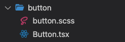

# 邊做邊紀錄
這邊之後會再拆分成不同的 wiki page  

## Interface 抽離

目前抽離狀況

- 基本上元件都需要的類  
存放位置： `packages/core/src/interface/common.ts`
```
  // type StyleBaseT
  className?: string;
  style?: CSSProperties;
```

```
  // type ParentsBaseT
  className?: string;
  style?: CSSProperties;
  children?: React.Node;
```

```
  // type ColorBaseT
  color?: 'default' | 'primary' | 'secondary' | 'success' | 'warning';
```

```
  // type VariantT (預期是這樣但尚未建立)  
  // default => outlined  
  variant?: 'text' | 'outlined' | 'contained' | 'underlined';  
```

- div tag類  
預期存放位置： `packages/core/src/interface/divType.ts`
```
 // something
```

持續新增ing...

## 判斷一下是否要使用以下其中一套件

[classnames](https://www.npmjs.com/package/classnames)  
[clsx](https://www.npmjs.com/package/clsx)

## CSS
1. 不使用單純指定 `html tag` 的方式寫樣式.

2. 一個元件的最外層css命名 `chips-button`.

3. 元件base樣式命名 `chips-form-base` 可能要邊做邊看.

4. scss變數: color, margin, padding, border, flexbox, position, fontsize, display, rwd, 單位基數 ...

5. web專案將使用 `styled-components`.


## Function 命名規則
```
// 一般function命名
onClick={handle[xxxxx]Clicked}
onChange={handle[xxxxx]Changed}

e.g. 
onClick={handleMenuClicked}
onChange={handleMenuChanged}
```

```
// 畫面渲染function命名
render[xxxxx]()

e.g.
renderButton()
```

```
命名 interface 時, 後綴 I

e.g.
ButtonPropsI

==========

命名 types 時, 後綴 T

e.g.  
StyleBaseT
```

## 資料夾/檔案命名規則

除了 `.tsx` 其餘皆為小駝峰，如以下：  
  

## core 專案 export 順序  
### 依照**資料夾**順序 export  
ex.  
在位置為 `packages/core/src/components/index.ts` 的檔案中的 export 順序為如下：  

將會依照**資料夾**順序做 export  
 

## web 專案 import 順序  
### 依照**web 左側選單**順序 import  
ex.  
在位置為 `packages/web/src/routes/index.tsx` 的檔案中的 import 順序為如下：  
 
將會依照**web 左側選單**順序做 import  
 

## Demo page template  
[Template](https://gitlab.com/asus-icr/chips/-/wikis/Demo-Page-Template)

## Issue創建規則
#### 規則
[元件名稱] Issue主題(句子開頭請大寫)  
- 如果是有專案需要用到，註明在issue內容
- 如果是尚未創建的元件(不知道元件名稱)，前綴用[NewComponent]，Example: [NewComponent] Drawer
- 如果是尚未創建的複合元件(不知道元件名稱)，前綴用[NewCompound]，Example: [NewCompound] System dropdown

#### 範例
Good: [TextField] Add error message  
Bad: [ONE-CMS Header] system card => 專案名稱不該出現在前綴，主題開頭沒有大寫  
Fix: [Card] Create system card (加註ONE-CMS Header在內容)